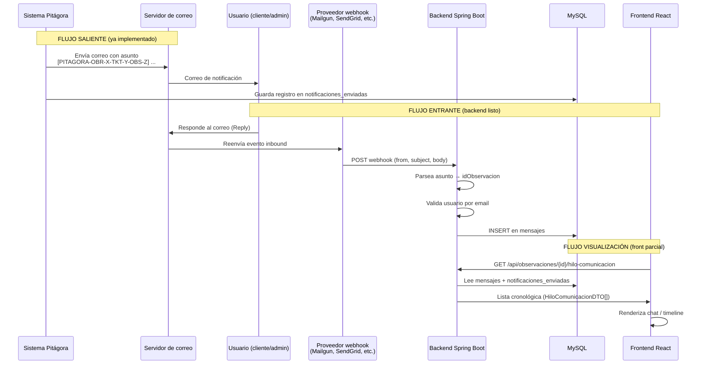

# Correos entrantes y hilo de comunicación — Pitágora

Guía para entender cómo la plataforma captura respuestas por correo electrónico y cómo preparar la visualización en el frontend.

---

## Resumen en una frase

Cuando Pitágora envía un correo sobre una observación, el asunto lleva un código identificador. Si el usuario **responde a ese correo**, un webhook del proveedor de email llama al backend, que guarda la respuesta como un **mensaje** vinculado a la observación. Luego, el frontend puede mostrar ese hilo mezclando mensajes de plataforma, respuestas por email y notificaciones enviadas.

---

## Problema que resuelve

En postventa, muchos usuarios prefieren responder por email en lugar de entrar a la plataforma. Sin esta función:

- Las respuestas por correo quedan fuera del sistema.
- El equipo no ve el historial completo de la conversación en un solo lugar.

Con esta función:

1. **Salida:** el sistema envía correos con un asunto estandarizado.
2. **Entrada:** las respuestas se capturan y se guardan en la tabla `mensajes`.
3. **Visualización (pendiente de pulir en front):** un endpoint une mensajes + notificaciones en un hilo cronológico.

---

## Diagrama del flujo completo



---

## Piezas del backend

### 1. Envío de correos y asunto identificador

**Archivo:** `NotificationService.java`

Cada vez que ocurre un evento relevante (nueva observación, cambio de estado, nuevo mensaje, recordatorio, rechazo), el sistema:

1. Construye un asunto con este formato:

```
[PITAGORA-OBR-{idObra}-TKT-{idTicket}-OBS-{idObservacion}] ticket de postventa número {idTicket}, observación {idObservacion}
```

2. Envía el correo HTML al destinatario.
3. Registra el envío en `notificaciones_enviadas` (sin guardar el cuerpo HTML completo; el campo `cuerpo` queda vacío).

**Tipos de notificación guardados:**

| `tipo_notificacion`   | Cuándo se dispara                          |
|-----------------------|--------------------------------------------|
| `nueva_observacion`   | Se crea una observación                    |
| `cambio_estado`       | Cambia el estado de la observación         |
| `nuevo_mensaje`       | Alguien escribe un mensaje en la plataforma|
| `recordatorio`        | Recordatorio de aceptación pendiente       |
| `rechazo_aceptacion`  | El cliente rechaza la solución             |

---

### 2. Captura de correos entrantes (webhook)

Hay **dos controladores** que hacen cosas similares. Conviene unificar en el futuro; hoy coexisten:

#### A) `InboundEmailController` — `/api/webhook/email/inbound`

| Aspecto        | Detalle |
|----------------|---------|
| Método         | `POST` |
| Body esperado  | JSON tipado (`InboundEmailRequest`) |
| Servicio       | `InboundEmailService.procesarCorreoEntrante()` |
| Parseo asunto  | Regex estricto: `[PITAGORA-OBR-(\d+)-TKT-(\d+)-OBS-(\d+)]` |
| Validaciones   | Observación existe, remitente registrado en `usuarios.correo` |
| Notificación   | **No** dispara `notificarMensajeCreado` al guardar |
| Seguridad      | `webhookSecret` definido en config pero **no se valida** |
| Toggle         | `app.email.inbound.enabled` (default `true`) |

**Ejemplo de body:**

```json
{
  "from": "cliente@empresa.com",
  "to": "postventa@pitagora.cl",
  "subject": "Re: [PITAGORA-OBR-12-TKT-45-OBS-789] ticket de postventa...",
  "body": "Acepto la solución propuesta.",
  "html_body": "<p>Acepto la solución propuesta.</p>"
}
```

#### B) `MailInboundController` — `/api/mail/inbound`

| Aspecto        | Detalle |
|----------------|---------|
| Método         | `POST` |
| Body esperado  | `Map` genérico (flexible para distintos proveedores) |
| Parseo asunto  | Regex laxo: `observacion[^0-9]*(\d+)` (solo extrae id observación) |
| Validaciones   | Usuario por email |
| Notificación   | **Sí** llama a `notificationService.notificarMensajeCreado()` |
| `fecha_envio`  | No la setea explícitamente (depende del default de BD) |

**Claves de payload que intenta leer:** `from`, `sender`, `from_email`, `subject`, `body`, `text`, `html`, etc.

---

### 3. Lógica central de procesamiento

**Archivo:** `InboundEmailService.java`

Pasos de `procesarCorreoEntrante(senderEmail, subject, body)`:

1. Parsear asunto → obtener `idObra`, `idTicket`, `idObservacion`.
2. Verificar que la observación exista.
3. Buscar usuario con `usuariosRepository.findByCorreo(email)`.
4. Crear registro en `mensajes` con `idObservacion`, `idUsuario`, `mensaje` (= cuerpo del email), `fechaEnvio`.
5. Devolver el `Mensajes` guardado (o `null` si falla alguna validación).

**Importante:** no hay campo en `mensajes` que indique que el mensaje vino por email. En el hilo aparece como `mensaje_manual`, igual que un mensaje escrito en la plataforma.

---

### 4. Modelo de datos

#### Tabla `mensajes`

| Campo           | Uso |
|-----------------|-----|
| `id_mensaje`    | PK |
| `id_observacion`| Observación a la que pertenece |
| `id_usuario`    | Usuario identificado por el email del remitente |
| `id_evidencia`  | Opcional (adjuntos desde plataforma) |
| `mensaje`       | Texto del mensaje o cuerpo del email |
| `fecha_envio`   | Timestamp |

#### Tabla `notificaciones_enviadas`

| Campo               | Uso |
|---------------------|-----|
| `id_notificacion`   | PK |
| `id_observacion`    | Observación relacionada |
| `destinatario`      | Email al que se envió |
| `asunto`            | Asunto del correo saliente |
| `cuerpo`            | Hoy se guarda vacío (`""`) |
| `tipo_notificacion` | Ver tabla arriba |
| `fecha_envio`       | Cuándo se envió |
| `estado_envio`      | `enviado` (default), `error`, `pending` |

Script SQL: `Producto/back/sql_scripts/04_create_notificaciones_table.sql`

---

### 5. Hilo de comunicación (lo que consumirá el front)

**Archivo:** `HiloComunicacionService.java`  
**Endpoint:** `GET /api/observaciones/{id_observacion}/hilo-comunicacion`  
**Controller:** `ObservacionesController.java`

Combina dos fuentes y las ordena por fecha:

| Origen DB              | `tipo` en DTO      | Campos relevantes |
|------------------------|--------------------|-------------------|
| `mensajes`             | `mensaje_manual`   | `remitente` (nombre), `contenido` (texto), `rol` (`cliente`/`admin`), `fecha` |
| `notificaciones_enviadas` | `notificacion`  | `remitente` (email destinatario), `asunto`, `contenido` (tipo + estado), `rol` = `sistema`, flags `aceptado`/`rechazado` |

**Estructura de `HiloComunicacionDTO`:**

```json
{
  "tipo": "mensaje_manual",
  "fecha": "2026-06-11T15:30:00",
  "remitente": "Juan Pérez",
  "asunto": null,
  "contenido": "Texto del mensaje o del email",
  "rol": "cliente",
  "aceptado": false,
  "rechazado": false
}
```

```json
{
  "tipo": "notificacion",
  "fecha": "2026-06-11T14:00:00",
  "remitente": "cliente@empresa.com",
  "asunto": "[PITAGORA-OBR-12-TKT-45-OBS-789] ticket de postventa...",
  "contenido": "cambio_estado (enviado)",
  "rol": "sistema",
  "aceptado": false,
  "rechazado": false
}
```

---

## Endpoints útiles para el frontend

| Método | Ruta | Para qué |
|--------|------|----------|
| `GET`  | `/api/observaciones/{id}/hilo-comunicacion` | **Principal:** hilo completo (mensajes + notificaciones) |
| `GET`  | `/api/mensajes/observacion/{id}` | Solo mensajes, con nombre de usuario y adjuntos (`MensajeDTO`) |
| `POST` | `/api/mensajes` (multipart) | Crear mensaje desde la plataforma |
| `GET`  | `/api/webhook/email/health` | Health check del webhook (no requiere auth hoy) |

Los endpoints de webhook inbound (`POST /api/webhook/email/inbound` y `POST /api/mail/inbound`) son para el proveedor de correo, no para el frontend.

---

## Estado actual del frontend

Ya existe trabajo parcial:

| Archivo | Qué hace |
|---------|----------|
| `ObservacionDetalleModal.jsx` | Llama a `hilo-comunicacion` al abrir la pestaña Mensajes |
| `ObservacionMensajesTab.jsx` | Renderiza `mensaje_manual` y `notificacion` |

### Desajuste importante entre API y UI

`ObservacionMensajesTab` fue pensado para `MensajeDTO` (endpoint `/api/mensajes/observacion/{id}`), pero ahora recibe `HiloComunicacionDTO`. Los nombres de campos no coinciden:

| Lo que espera el componente | Lo que devuelve `hilo-comunicacion` |
|----------------------------|-------------------------------------|
| `msg.mensaje`              | `msg.contenido` |
| `msg.fechaEnvio`           | `msg.fecha` |
| `msg.nombreUsuario`        | `msg.remitente` (nombre completo en un solo string) |
| `msg.idUsuario`            | No viene |
| `msg.urlArchivo`           | No viene (emails no traen adjuntos hoy) |

**Consecuencia:** si el front usa solo `hilo-comunicacion`, los mensajes manuales (incluidas respuestas por email) se muestran mal: sin texto, sin fecha, usuario genérico "Usuario".

Las notificaciones sí se renderizan razonablemente porque el componente ya contempla `tipo === 'notificacion'`.

---

## ¿Está el backend listo para implementar el front?

### Lo que SÍ está listo

- Captura de emails entrantes y persistencia en `mensajes`.
- Identificación de observación vía asunto estandarizado.
- Validación de remitente contra usuarios registrados.
- Registro de correos salientes en `notificaciones_enviadas`.
- Endpoint de hilo cronológico unificado.
- `findByCorreo` implementado en `UsuariosRepository`.
- Tabla SQL y repositorio de notificaciones.
- Front base con pestaña Mensajes y llamada al endpoint correcto.

### Gaps y riesgos antes / durante el front

| Prioridad | Tema | Detalle |
|-----------|------|---------|
| Alta | Formato DTO vs UI | Adaptar `ObservacionMensajesTab` a `HiloComunicacionDTO` o enriquecer el DTO en backend (`idMensaje`, `idUsuario`, `mensaje`, `fechaEnvio`, `origen`) |
| Alta | Dos webhooks duplicados | `MailInboundController` y `InboundEmailController` con lógica distinta; elegir uno y deprecar el otro |
| Media | Sin distinción email vs plataforma | No hay `origen` (`email` / `plataforma`); el usuario no puede saber si un mensaje fue reply por correo |
| Media | Seguridad webhook | `webhookSecret` no se valida; cualquiera podría POSTear mensajes falsos |
| Media | Notificaciones sin cuerpo | `cuerpo` siempre vacío; en el hilo solo se ve tipo y asunto, no el HTML del correo |
| Media | Inbound sin notificación | `InboundEmailController` no avisa a otras partes cuando llega un email (el otro controller sí) |
| Baja | Adjuntos en emails | No se procesan attachments del webhook |
| Baja | HTML en respuestas | Se guarda body/html tal cual; puede incluir citas del correo anterior |
| Baja | `MailInboundController` no setea `fechaEnvio` | Funciona si la BD tiene default, pero es inconsistente |

### Veredicto

**Sí, puedes avanzar con el frontend**, usando `GET /api/observaciones/{id}/hilo-comunicacion` como fuente principal. El backend cubre el ciclo captura → almacenamiento → lectura.

Lo mínimo para que la UI funcione bien:

1. Mapear en el front (o ajustar el DTO en back) los campos `contenido` → `mensaje`, `fecha` → `fechaEnvio`, `remitente` → nombre visible.
2. Decidir cómo mostrar notificaciones (hoy solo asunto + tipo, sin cuerpo del correo).
3. Opcional pero recomendable: añadir `origen: "email" | "plataforma"` en mensajes para el UX.

---

## Casos de uso del hilo en la UI

### Vista tipo chat (pestaña Mensajes en detalle de observación)

```
[Notificación]  Sistema → cliente@...  "Cambio de estado"     10:00
[Mensaje]       Juan Pérez (cliente)   "¿Cuándo vienen?"        10:15
[Notificación]  Sistema → admin@...      "Nuevo mensaje"          10:16
[Mensaje]       Admin                  "Mañana a las 9"         10:30
[Mensaje]       Juan Pérez (email)     "Perfecto, gracias"      11:00  ← reply por correo
```

### Reglas de presentación sugeridas

| `tipo` | `rol` | UI sugerida |
|--------|-------|-------------|
| `mensaje_manual` | `cliente` | Burbuja izquierda, color claro |
| `mensaje_manual` | `admin` | Burbuja derecha o color distinto |
| `notificacion` | `sistema` | Tarjeta centrada / timeline, icono sobre |
| `notificacion` + `aceptado` | — | Badge verde |
| `notificacion` + `rechazado` | — | Badge rojo |

---

## Configuración relevante

Propiedades en `application.properties` / variables de entorno (valores por defecto en código):

```properties
app.email.inbound.enabled=true
app.webhook.secret=webhook-secret-key-pitagora-12345
app.email.subject.format=[PITAGORA-OBR-{idObra}-TKT-{idTicket}-OBS-{idObservacion}]
app.site.url=http://localhost:5173
app.backend.url=http://localhost:8080
```

Para producción necesitarás:

1. Configurar el proveedor de email (Mailgun, SendGrid, Amazon SES, etc.) para que el inbound apunte a `POST /api/webhook/email/inbound` (o `/api/mail/inbound` si prefieres el formato flexible).
2. Validar el secret del webhook.
3. Asegurar que la tabla `notificaciones_enviadas` exista en la BD.

---

## Archivos clave (mapa rápido)

```
Producto/back/
├── controller/
│   ├── InboundEmailController.java    # Webhook tipado /api/webhook/email
│   ├── MailInboundController.java     # Webhook genérico /api/mail
│   └── ObservacionesController.java   # GET hilo-comunicacion
├── service/
│   ├── InboundEmailService.java       # Parseo asunto + guardar mensaje
│   ├── HiloComunicacionService.java   # Unir mensajes + notificaciones
│   └── NotificationService.java       # Envío saliente + guardar notificación
├── model/
│   ├── Mensajes.java
│   └── NotificacionesEnviadas.java
├── dto/
│   ├── InboundEmailRequest.java
│   └── HiloComunicacionDTO.java
└── sql_scripts/
    └── 04_create_notificaciones_table.sql

Producto/front/
├── components/
│   ├── ObservacionDetalleModal.jsx    # Carga el hilo
│   └── ObservacionMensajesTab.jsx     # Render (necesita ajuste de campos)
└── services/
    └── mensajesService.js             # CRUD mensajes desde plataforma
```

---

## Próximos pasos recomendados

### Backend (opcional pero útil)

1. Unificar en un solo endpoint inbound.
2. Validar `signature` / `webhookSecret`.
3. Llamar a `notificarMensajeCreado` también desde `InboundEmailService`.
4. Añadir campo `origen` en `mensajes` (`plataforma` | `email`).
5. Enriquecer `HiloComunicacionDTO` con campos que el front ya espera.

### Frontend (tu siguiente tarea)

1. Corregir mapeo de campos en `ObservacionMensajesTab` para `HiloComunicacionDTO`.
2. Mostrar icono o etiqueta "vía email" cuando corresponda (tras añadir `origen`).
3. Mejorar vista de notificaciones (expandir asunto, mostrar tipo legible).
4. Probar flujo end-to-end: enviar correo → responder → ver mensaje en hilo.

---

## Prueba manual rápida (sin proveedor de email)

Simular un correo entrante:

```bash
curl -X POST http://localhost:8080/api/webhook/email/inbound \
  -H "Content-Type: application/json" \
  -d '{
    "from": "usuario-registrado@ejemplo.com",
    "subject": "Re: [PITAGORA-OBR-1-TKT-2-OBS-3] ticket de postventa",
    "body": "Mensaje de prueba desde email"
  }'
```

Luego verificar el hilo:

```bash
curl http://localhost:8080/api/observaciones/3/hilo-comunicacion
```

(Reemplaza IDs y email por datos reales de tu BD.)
