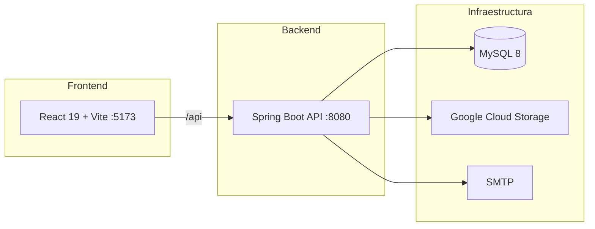

# Pitágora


Aplicación web para centralizar y automatizar la gestión de postventa de la **Constructora Pitágora**. Organiza reclamos bajo un modelo de **tickets por obra**, con seguimiento de observaciones, evidencias, mensajería, notificaciones por correo y dashboard de estadísticas.

## Tabla de contenidos

- [Acerca del proyecto](#acerca-del-proyecto)
- [Arquitectura](#arquitectura)
- [Stack](#stack)
- [Estructura del repositorio](#estructura-del-repositorio)
- [Requisitos previos](#requisitos-previos)
- [Configuración](#configuración)
- [Instalación](#instalación)
- [Ejecución en local](#ejecución-en-local)
- [Roles y rutas](#roles-y-rutas)
- [Funcionalidades principales](#funcionalidades-principales)
- [API REST](#api-rest)
- [Scripts útiles](#scripts-útiles)
- [Documentación adicional](#documentación-adicional)
- [Seguridad](#seguridad)
- [Contribuir](#contribuir)
- [Licencia](#licencia)

## Acerca del proyecto

Pitágora digitaliza el flujo de postventa en obras de construcción:

- Los **clientes** crean tickets y observaciones sobre fallas detectadas en sus obras.
- Los **administradores** gestionan usuarios, clientes, obras, tickets y el seguimiento completo de cada reclamo.
- El sistema registra evidencias fotográficas, mensajes, costos, bitácora y envía notificaciones automáticas.

## Arquitectura



## Stack

| Capa | Tecnología |
|------|------------|
| Backend | Java 17, Spring Boot 3.5, Gradle |
| Frontend | React 19, Vite 8, React Router 7, Bootstrap 5 |
| Base de datos | MySQL 8 (local en desarrollo, Cloud SQL en producción) |
| Almacenamiento | Google Cloud Storage (evidencias) |
| Correo | Spring Mail (SMTP) |
| Exportación | jsPDF, xlsx |

## Estructura del repositorio

```
pitagora/
├── Producto/
│   ├── back/                    # API REST (Spring Boot)
│   │   └── sql_scripts/         # Dump de la base de datos
│   └── front/                   # Cliente web (React + Vite)
├── Documentación/               # Manuales, mockups y actas
└── Gestión/                     # Planificación del proyecto
```

## Requisitos previos

- **Java 17**
- **Node.js** y **npm**
- **MySQL 8** (local o Cloud SQL)
- **Credenciales GCP** (para subida de evidencias)
- **Git**

Verificar instalación:

```bash
java -version
node -v
npm -v
```

## Configuración

### Base de datos

La aplicación se conecta a MySQL mediante JDBC estándar (`spring.datasource.url`). No hay dependencias específicas de Google para la base de datos: **cualquier instancia MySQL 8 funciona**. En producción el proyecto está desplegado sobre **Cloud SQL** (MySQL gestionado en GCP); para desarrollo local basta con MySQL en tu máquina.

El esquema y los datos de prueba están en un único dump en [`Producto/back/sql_scripts/`](Producto/back/sql_scripts/):

| Archivo | Descripción |
|---------|-------------|
| `Cloud_SQL_Export_2026-06-20 (11-48-12).sql` | Dump completo de `sistema_postventa_pitagora` (tablas + datos) |

Importar la base de datos:

```bash
mysql -u TU_USUARIO -p < "Producto/back/sql_scripts/Cloud_SQL_Export_2026-06-20 (11-48-12).sql"
```

> El nombre del archivo contiene espacios y paréntesis; usa comillas en la ruta.

**Conexión en `application.properties`:**

| Entorno | Ejemplo de URL |
|---------|----------------|
| Desarrollo (MySQL local) | `jdbc:mysql://localhost:3306/sistema_postventa_pitagora` |
| Producción (Cloud SQL) | `jdbc:mysql://IP_O_HOST:3306/sistema_postventa_pitagora?useSSL=true&serverTimezone=UTC` |

Solo cambia `spring.datasource.url`, usuario y contraseña según dónde corra MySQL.

### Backend (`Producto/back/`)

1. Copiar la plantilla de configuración:

```bash
cp Producto/back/src/main/resources/application.properties.example \
   Producto/back/src/main/resources/application.properties
```

2. Completar los valores en `application.properties` (base de datos, correo, GCP).

3. Colocar las credenciales de GCP en `Producto/back/gcp-credentials.json`.

Ambos archivos están en `.gitignore` y **no deben subirse al repositorio**.

Propiedades principales:

| Propiedad | Descripción |
|-----------|-------------|
| `spring.datasource.*` | Conexión a MySQL |
| `spring.jpa.hibernate.ddl-auto` | Usar `none` o `validate` (no `create`) |
| `spring.servlet.multipart.max-file-size` | Límite por imagen (10 MB) |
| `spring.mail.*` | SMTP para bienvenida, recuperación de contraseña y recordatorios |
| `app.site.url` | URL del frontend (enlaces en correos) |
| `gcp.bucket.name` / `gcp.config.path` | Bucket y credenciales de GCS |

### Frontend (`Producto/front/`)

El frontend consume la API en `http://localhost:8080/api`. No requiere archivo `.env` adicional para desarrollo local.

## Instalación

### Backend

```bash
cd Producto/back
./gradlew build
```

### Frontend

```bash
cd Producto/front
npm install
```

## Ejecución en local

Abrir **dos terminales**:

**Terminal 1 — API (puerto 8080):**

```bash
cd Producto/back
./gradlew bootRun
```

**Terminal 2 — Frontend (puerto 5173):**

```bash
cd Producto/front
npm run dev
```

Abrir [http://localhost:5173](http://localhost:5173) en el navegador.

## Roles y rutas

| Rol | Descripción | Rutas principales |
|-----|-------------|-------------------|
| `admin` | Panel de administración completo | `/admin-dashboard`, `/admin/tickets`, `/admin/clientes`, `/admin/obras`, `/admin/usuarios`, `/admin/reportes`, `/admin/buscar` |
| `usuario` | Cliente con acceso a sus obras | `/dashboard`, `/perfil`, `/crear-ticket`, `/crear-observacion`, `/mensajes` |

Rutas públicas: `/login`, `/reset-password`.

## Funcionalidades principales

- Login, recuperación y restablecimiento de contraseña
- CRUD de usuarios, clientes y obras
- Creación y seguimiento de tickets y observaciones
- Evidencias fotográficas en Google Cloud Storage (máx. 10 MB por imagen, hasta 2 por observación)
- Mensajería por observación y bandeja de correos entrantes
- Costos desglosados por observación
- Notificaciones por correo y recordatorios programados de aceptación
- Dashboard con KPIs, top de fallas y gráficos
- Reportes de bitácora por obra
- Buscador global

## API REST

Prefijo base: `http://localhost:8080/api`

| Recurso | Controller |
|---------|------------|
| `/usuarios` | Login, CRUD, recuperación de contraseña |
| `/clientes`, `/obras`, `/tickets`, `/observaciones` | Gestión del dominio principal |
| `/evidencias`, `/mensajes`, `/costos-observacion` | Adjuntos, chat y costos |
| `/dashboard` | Estadísticas y gráficos |
| `/reportes`, `/buscador` | Reportes y búsqueda global |
| `/correos-entrantes`, `/webhook/email` | Correos entrantes |
| `/regiones`, `/comunas`, `/categorias` | Catálogos |

Documentación técnica del dashboard: [`Producto/front/src/components/dashboard/README.md`](Producto/front/src/components/dashboard/README.md).

## Scripts útiles

| Comando | Ubicación | Descripción |
|---------|-----------|-------------|
| `./gradlew bootRun` | `Producto/back` | Levantar API |
| `./gradlew test` | `Producto/back` | Ejecutar tests |
| `npm run dev` | `Producto/front` | Servidor de desarrollo |
| `npm run build` | `Producto/front` | Build de producción |
| `npm run lint` | `Producto/front` | Linter |
| `npm run preview` | `Producto/front` | Vista previa del build |

## Documentación adicional

Documentos en la carpeta [`Documentación/`](Documentación/):

| Documento | Contenido |
|-----------|-----------|
| `Manual de usuario [Usuario] Pitagora.docx` | Guía para usuarios finales |
| `Manual de instalación y despliegue.docx` | Instalación y despliegue |
| `Mockups.docx` | Diseños de interfaz |
| `Casos de Uso/Plantillas Casos de Uso.docx` | Casos de uso del sistema |
| `Actas de Reunion/` | Actas de reuniones del proyecto |

## Seguridad

**Nunca commitear** los siguientes archivos:

- `Producto/back/src/main/resources/application.properties`
- `Producto/back/gcp-credentials.json`
- Archivos `.env` con credenciales

Estos archivos ya están listados en `.gitignore`. Solicita las credenciales al equipo antes de configurar tu entorno local.

## Contribuir

1. Crear una rama desde `main`
2. Hacer los cambios y probar en local (backend + frontend)
3. Abrir un Pull Request con descripción clara del cambio

## Licencia

Proyecto privado — Constructora Pitágora. Consultar al equipo antes de redistribuir.
